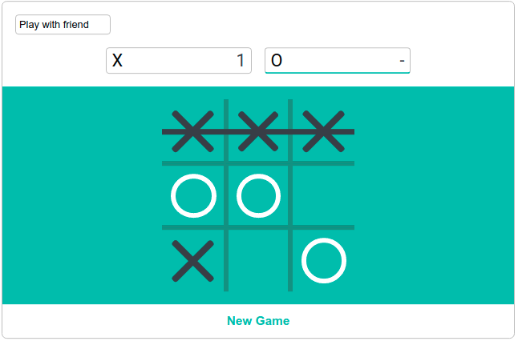

# Tic-Tac-Toe

## Table of contents

- [General info](#general-info)
- [Technologies](#tenchnologies)
- [Setup](#setup)

## General info

Tic-tac-toe game written in vanilla javascript with two game modes (player vs player and player vs AI). Implemented minimax algorithm makes AI unbeatable.

## Technologies

Project is created with:

- Vanilla JavaScript
- HTML5
- CSS3

## Setup

To run this project, install it locally using npm or yarn:

```
$ npm install / yarn
$ npm start dev / yarn dev
```

## Screenshot


